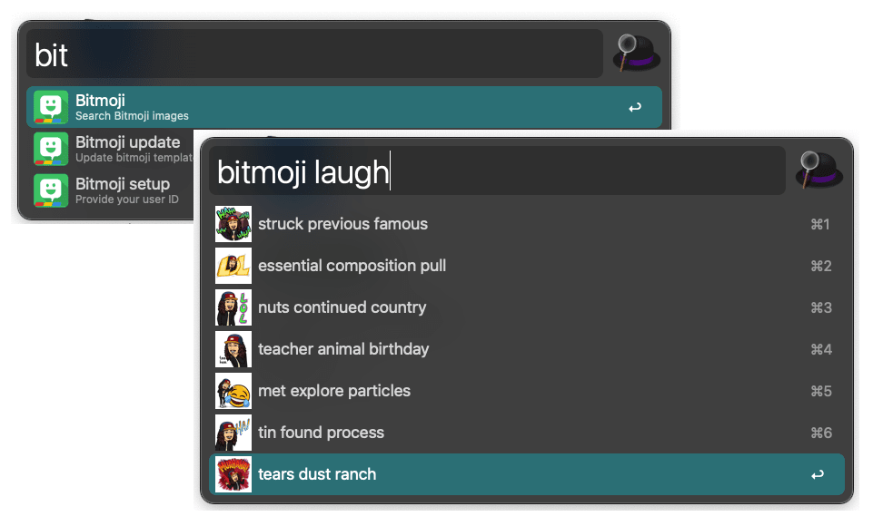

# Alfred Bitmoji

> [Alfred](https://www.alfredapp.com) workflow to interact with Bitmoji and get comics URLs

*Requires [Node.js](https://nodejs.org) 8+ and the Alfred [Powerpack](https://www.alfredapp.com/powerpack/).*

## Requirements

- Have a Bitmoji account. If you don't have one already go to: [bitmoji.com](https://www.bitmoji.com/)
- Have your Bitmoji user ID

> How do I get my Bitmoji ID?

The easiest way is to extract it from an image URL generated by the bitmoji extension for google chrome!

Example:
These are 4 URLs extract from the Chrome extension. That's the part of the URL, that's your ID:

## Download

[alfred-bitmoji.alfredworkflow](./alfred-bitmoji-1.0.alfredworkflow)

## Setup

>With the package installed and your **user ID**

### Run Bitmoji setup

In Alfred, type `bitmoji setup`, <kbd>Enter</kbd>, and paste your **user ID**.

*This will save it inside the workflow as an environment variable and you are now good to use it.*

## Usage

### Markdown style

In Alfred, type `bitmoji`, <kbd>Enter</kbd>, and search term, to find a bitmoji (_terms will match base on bitmojis tags on their own templates_).

Select an bitmoji and press <kbd>Enter</kbd> to copy the URL to the clipboard wrapped in a `markdown` syntax ready to be use inside any markdown.

### Pure URL

In Alfred, type `bitmoji`, <kbd>Enter</kbd>, and search term, to find a bitmoji (_terms will match base on bitmojis tags on their own templates_).

Select an bitmoji, hold <kbd>Command</kbd> and press <kbd>Enter</kbd> to copy the URL it to the clipboard.

### Open in Browser

In Alfred, type `bitmoji`, <kbd>Enter</kbd>, and search term, to find a bitmoji (_terms will match base on bitmojis tags on their own templates_).

Select an bitmoji, hold <kbd>Option</kbd> and press <kbd>Enter</kbd> to open it in your default browser.

## Related

- [libmoji](https://github.com/matthewnau/libmoji) - Library to interact with Bitmoji API
- [alfy](https://github.com/sindresorhus/alfy) - Create Alfred workflows with ease

## Shoutouts

- To [@sindresorhus](https://github.com/sindresorhus) for Alfy and the inspiration for the README of this project
- To [@matthewnau](https://github.com/matthewnau) for doing providing a clean API to interact with Bitmojis JSON files
- To [@jpoles1](https://github.com/jpoles1) for [friendmojis](https://github.com/jpoles1/bitmoji) experiment that help me clear my mind around this.

## License

MIT © [Diego La Manno](https://diegolamanno.com)
